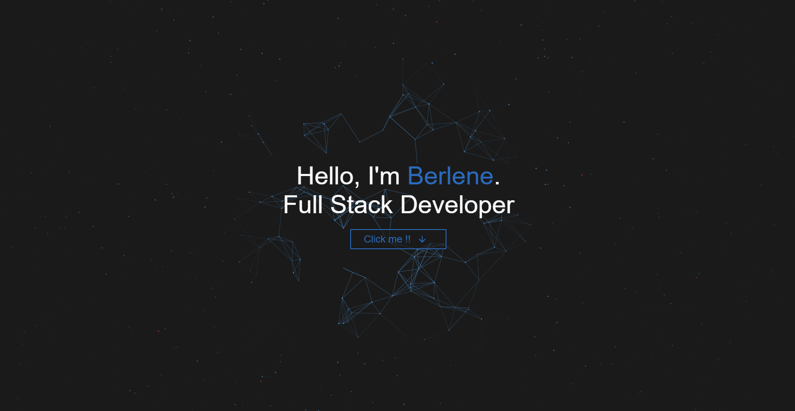

<h1 align="center">Hi! I'm Berlene</h1>
<h3 align="center">Web and Mobile Developer</h3>

  
  
  

---

- 4th-year BSIT student, specializing in Web and Mobile Application Development.
<!-- - A Full Stack Developer who specializes in backend logic, APIs, and data handling -->

<strong>Visit my portfolio to see my projects</strong>
 

  

  <a href="https://blynsu.vercel.app/" target="_blank">
    <code>https://blynsu.vercel.app</code>
  </a>

---

## Technical Skills

### Frontend

### Backend

### Databases

### Tools & Platforms

### Programming Languages

---

### GitHub Stats

<!--       
    
    
    -->

    
  

<!-- ---

### Contribution Activity

  

 -->
